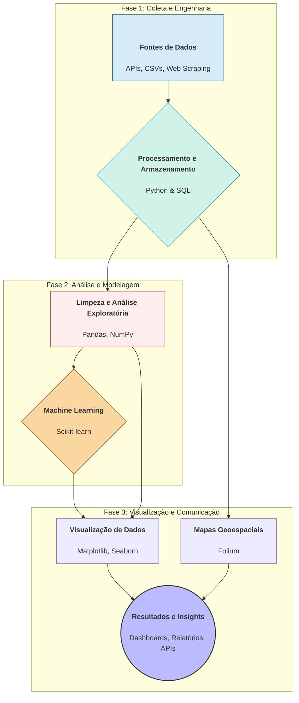

<div align="center">
  
  
  
</div>

<br>

**Autor / Author:** Jefferson Firmino Mendes  
**Contato / Contact:** [GitHub](https://github.com/jeffthedeveloper) | [LinkedIn](https://www.linkedin.com/in/jfconsultoria/)

## 📄 Resumo / Abstract

<br><br> * 🇧🇷 Este repositório é a tese final do Certificado Profissional IBM Data Science, demonstrando um fluxo de trabalho completo de ponta a ponta. O projeto resolve problemas práticos em domínios como mercado imobiliário, finanças e logística espacial, utilizando Python, SQL e Machine Learning. O principal resultado é um portfólio de análises, modelos preditivos e dashboards interativos que validam competências essenciais para um cientista de dados.
<br><br> * 🇺🇸 This repository is the final thesis for the IBM Data Science Professional Certificate, demonstrating a complete end-to-end workflow. The project solves practical problems in domains such as real estate, finance, and space logistics using Python, SQL, and Machine Learning. The main outcome is a portfolio of analyses, predictive models, and interactive dashboards that validate a data scientist's core competencies.

## 🎓 A Tese: Uma Jornada de Maestria / The Thesis: A Journey of Mastery

<br><br> * 🇧🇷 Este repositório é a materialização da minha jornada através do universo da Ciência de Dados. Ele não é uma simples coleção de projetos, mas sim a **tese final** que consolida e conecta uma vasta gama de habilidades. Como um Trabalho de Conclusão de Curso (TCC), ele representa o ápice do aprendizado, onde teoria e prática se encontram para resolver problemas do mundo real.
<br><br> * 🇺🇸 This repository embodies my journey through the Data Science universe. It's not a mere collection of projects, but rather the **final thesis** that consolidates and connects a wide range of skills. Like a final graduation project, it represents the pinnacle of learning, where theory and practice meet to solve real-world problems.

## 🕵️ Prova de Autoria, Proatividade e Ambiente Profissional / Proof of Authorship, Proactivity, and Professional Environment

<br><br> * 🇧🇷 Para garantir a transparência e validar a autenticidade do trabalho, este repositório foi estruturado para conter múltiplas **"impressões digitais" forenses**. Elas comprovam não apenas a autoria, mas também uma abordagem proativa que transcende o escopo de um curso online, refletindo a mentalidade de um cientista de dados profissional.
<br><br> * 🇺🇸 To ensure transparency and validate the authenticity of the work presented, this repository has been structured to contain multiple **forensic "digital fingerprints"**. These prove not only the authorship but also a proactive approach that transcends the scope of a standard online course, reflecting a professional data scientist's mindset.

  <br><br> * 🇧🇷 **Execução em Ambiente Linux Local:** Conforme visível em múltiplos notebooks, como o de [geração de relatórios em PDF](https://github.com/jeffthedeveloper/Applied-Data-Science-Capstone-End-to-End-Analysis-with-Python-SQL-and-Machine-Learning/blob/main/PDF-PROJECT/PDF-PROJECT.ipynb), os tracebacks de execução apontam diretamente para um diretório `home` de um sistema Ubuntu (`/home/jeff/...`). Isso é uma prova irrefutável de que os projetos foram desenvolvidos e testados em um ambiente de trabalho real, e não em uma plataforma online padronizada.
    <br><br> * 🇺🇸 **Execution in a Local Linux Environment:** As seen in multiple notebooks, such as the [PDF report generator](https://github.com/jeffthedeveloper/Applied-Data-Science-Capstone-End-to-End-Analysis-with-Python-SQL-and-Machine-Learning/blob/main/PDF-PROJECT/PDF-PROJECT.ipynb), execution tracebacks point directly to a local Ubuntu home directory (`/home/jeff/...`). This serves as irrefutable proof that the projects were developed and tested in a real-world, customized environment, not on a standardized online platform. <br>
  <br><br> * 🇧🇷 **Customização e Localização (PT-BR):** Diversos artefatos contêm gráficos, comentários e saídas de texto customizadas em português brasileiro. Esta personalização, visível desde as dicas traduzidas no [notebook de SQL](https://github.com/jeffthedeveloper/Applied-Data-Science-Capstone-End-to-End-Analysis-with-Python-SQL-and-Machine-Learning/blob/main/Applied-Capstone/Peer-Assignment/DB0201EN-PeerAssign-v5.ipynb) até os gráficos nos [projetos de análise de ações](https://github.com/jeffthedeveloper/Applied-Data-Science-Capstone-End-to-End-Analysis-with-Python-SQL-and-Machine-Learning/tree/main/Applied-Capstone/THIRD%20PYTHON%20PROJECT), é uma forte evidência de que a análise e a interpretação dos dados foram realizadas de forma original.
    <br><br> * 🇺🇸 **Customization and Localization (PT-BR):** Various artifacts contain custom charts, comments, and text outputs in Brazilian Portuguese. This personalization, visible from the translated hints in the [SQL notebook](https://github.com/jeffthedeveloper/Applied-Data-Science-Capstone-End-to-End-Analysis-with-Python-SQL-and-Machine-Learning/blob/main/Applied-Capstone/Peer-Assignment/DB0201EN-PeerAssign-v5.ipynb) to the charts in [stock analysis projects](https://github.com/jeffthedeveloper/Applied-Data-Science-Capstone-End-to-End-Analysis-with-Python-SQL-and-Machine-Learning/tree/main/Applied-Capstone/THIRD%20PYTHON%20PROJECT), is strong evidence of original analysis and interpretation. <br>
  <br><br> * 🇧🇷 **Iniciativa na Curadoria de Dados:** O trabalho demonstra proatividade na gestão dos datasets. Em cenários onde os dados originais do curso estavam desatualizados, houve a iniciativa de substituí-los por fontes mais recentes e relevantes do Kaggle, uma prática comum e essencial para cientistas de dados no mercado.
    <br><br> * 🇺🇸 **Proactive Data Curation:** This work demonstrates initiative in data management. In scenarios where original course datasets were outdated, they were replaced with more recent and relevant sources from Kaggle—a common and essential practice for data scientists.<br>
  <br><br> * 🇧🇷 **Uso Estratégico de Formatos para Proteção Intelectual:** A presença de entregáveis em formatos estáticos como `.pdf` e `.png` é uma decisão deliberada para apresentar os resultados de forma clara, ao mesmo tempo em que se protege a propriedade intelectual do código, incentivando a consulta em vez do plágio.
    <br><br> * 🇺🇸 **Strategic Use of Formats for IP Protection:** The deliberate use of static deliverables like `.pdf` and `.png` showcases the results and methodology clearly while protecting the underlying code's intellectual property, encouraging consultation over plagiarism.<br>
  <br><br> * 🇧🇷 **Consolidação e Síntese de Conhecimento:** Artefatos como o documento [**Data Science Ecosystem**](https://github.com/jeffthedeveloper/Applied-Data-Science-Capstone-End-to-End-Analysis-with-Python-SQL-and-Machine-Learning/blob/main/Applied-Capstone/datascienceecosystem.pdf) e a [**Apresentação Final**](https://drive.google.com/file/d/1lgArDDKVNuzi1ucUSftZAgvOwFCHdOkG/view?usp=sharing) não são meros templates, mas o resultado da consolidação e síntese do conhecimento adquirido, demonstrando a capacidade de comunicar resultados complexos de forma estruturada.
    <br><br> * 🇺🇸 **Knowledge Consolidation and Synthesis:** Artifacts like the [**Data Science Ecosystem**](https://github.com/jeffthedeveloper/Applied-Data-Science-Capstone-End-to-End-Analysis-with-Python-SQL-and-Machine-Learning/blob/main/Applied-Capstone/datascienceecosystem.pdf) document and the [**Final Presentation**](https://drive.google.com/file/d/1lgArDDKVNuzi1ucUSftZAgvOwFCHdOkG/view?usp=sharing) are not mere templates but the result of consolidating and synthesizing the acquired knowledge, demonstrating the ability to communicate complex results effectively. <br>

## 📜 Certificação Profissional / Professional Certification

<div align="center">
  <a href="https://www.coursera.org/account/accomplishments/professional-cert/6EL13PHTZB3Z" target="_blank" rel="noopener noreferrer">
    
  </a>
  <br>
  <em><p><br><br> * 🇧🇷 Clique na imagem acima para verificar a certificação.<br>🇺🇸 Click the image above to verify the certification.</p></em>
</div>

<br><br> * 🇧🇷 A especialização profissional é composta por uma série de cursos rigorosos que desenvolvem competências essenciais e aplicadas na área de Ciência de Dados.
<br><br> * 🇺🇸 The professional specialization consists of a series of rigorous courses that develop essential and applied competencies in the field of Data Science.

### Habilidades Adquiridas / Skills Gained

| Categoria / Category | Habilidades / Skills |
| :--- | :--- |
| **Análise de Dados / Data Analysis** | Análise de Regressão (Regression Analysis), Mineração de Dados (Data Mining), SQL, Análise Exploratória de Dados (Exploratory Data Analysis). |
| **Machine Learning** | Scikit-learn, Aprendizado Supervisionado (Supervised Learning), Aprendizado Não Supervisionado (Unsupervised Learning). |
| **Ferramentas e Linguagens / Tools & Languages** | Python, SQL, Jupyter Notebooks, Pandas, NumPy. |
| **Visualização de Dados / Data Visualization** | Matplotlib, Seaborn, Plotly, Folium. |
| **Tecnologias Emergentes / Emerging Technologies** | IA Generativa (Generative AI). |
| **Competências Profissionais / Professional Skills** | Alfabetização de Dados (Data Literacy), Networking Profissional (Professional Networking). |

### Cursos da Especialização / Specialization Courses

  * What is Data Science?
  * Tools for Data Science
  * Data Science Methodology
  * Generative AI: Elevate Your Data Science Career
  * Data Scientist Career Guide and Interview Preparation
  * Applied Data Science Capstone

## 🏆 Destaques do Projeto: Habilidades em Ação / Project Highlights: Skills in Action

| Competência / Competency | Descrição / Description | Artefato Principal / Key Artifact |
| :--- | :--- | :--- |
| **Engenharia de Dados e SQL** <br><br> *Data Engineering & SQL* | <br><br> * 🇧🇷 Análise de múltiplos datasets da cidade de Chicago para responder a perguntas complexas usando queries SQL com `JOINS`, `CASE` e subqueries.<br><br> * 🇺🇸 Analysis of multiple Chicago datasets to answer complex questions using SQL queries with `JOINS`, `CASE`, and subqueries. | [Análise de Dados de Chicago com SQL](https://github.com/jeffthedeveloper/Applied-Data-Science-Capstone-End-to-End-Analysis-with-Python-SQL-and-Machine-Learning/blob/main/Applied-Capstone/Peer-Assignment/DB0201EN-PeerAssign-v5.ipynb) |
| **Machine Learning Preditivo** <br><br> *Predictive Machine Learning* | <br><br> * 🇧🇷 Desenvolvimento ponta a ponta de modelos de Regressão para prever preços de imóveis, validado por uma série de screenshots que provam a construção da solução.<br><br> * 🇺🇸 End-to-end development of Regression models to predict house prices, validated by a series of screenshots proving the solution's construction. | [Evidências do Projeto de Machine Learning](https://github.com/jeffthedeveloper/Applied-Data-Science-Capstone-End-to-End-Analysis-with-Python-SQL-and-Machine-Learning/tree/main/Applied-Capstone/PROJETO%20FINAL%20PYTHON) |
| **Web Scraping e APIs** <br><br> *Web Scraping & APIs* | <br><br> * 🇧🇷 Extração de dados de ações (Tesla & GME) via `yfinance` e `BeautifulSoup` para a construção de um dashboard interativo.<br><br> * 🇺🇸 Extraction of stock data (Tesla & GME) via `yfinance` and `BeautifulSoup` to build an interactive dashboard. | [Dashboard e Web Scraping de Ações](https://github.com/jeffthedeveloper/Applied-Data-Science-Capstone-End-to-End-Analysis-with-Python-SQL-and-Machine-Learning/blob/main/Applied-Capstone/final-assignment.ipynb) |
| **Análise Geoespacial Interativa** <br><br> *Interactive Geospatial Analysis* | <br><br> * 🇧🇷 Criação de um mapa interativo com Folium para analisar a localização dos locais de lançamento da SpaceX e sua relação com a infraestrutura circundante.<br><br> * 🇺🇸 Creation of an interactive map with Folium to analyze SpaceX launch site locations and their relationship with surrounding infrastructure. | [Visualização Interativa com Folium](https://github.com/jeffthedeveloper/Applied-Data-Science-Capstone-End-to-End-Analysis-with-Python-SQL-and-Machine-Learning/blob/main/Applied-Capstone/06_SpaceX_Interactive_Visual_Analytics_Folium.ipynb) |
| **Automação de Relatórios (PDF)** <br><br> *Report Automation (PDF)* | <br><br> * 🇧🇷 Desenvolvimento de um script em Python para automatizar a geração de relatórios em PDF, consolidando múltiplas análises em um documento profissional.<br><br> * 🇺🇸 Development of a Python script to automate the generation of PDF reports, consolidating multiple analyses into a professional document. | [Gerador de Relatórios em PDF](https://github.com/jeffthedeveloper/Applied-Data-Science-Capstone-End-to-End-Analysis-with-Python-SQL-and-Machine-Learning/blob/main/PDF-PROJECT/PDF-PROJECT.ipynb) |

## 📊 Destaques Visuais e Análises Aprofundadas / Visual Highlights & In-Depth Analyses

<br><br> * 🇧🇷 Demonstrações visuais dos principais projetos do curso e das análises proativas desenvolvidas para expandir o escopo original, validando a aplicação prática das competências.
<br><br> * 🇺🇸 Visual demonstrations of the main course projects and the proactive analyses developed to expand the original scope, validating the practical application of the competencies.

-----

### 📈 Análise Preditiva de Preços de Imóveis / Predictive House Pricing Analysis

<br><br> * 🇧🇷 Este GIF demonstra o processo de análise exploratória e a performance do modelo de regressão para prever os preços dos imóveis.
<br><br> * 🇺🇸 This GIF demonstrates the exploratory data analysis process and the performance of the regression model for predicting house prices.

<div align="center">

</div>

-----

### 📉 Dashboard de Ações com Web Scraping / Stock Dashboard with Web Scraping

<br><br> * 🇧🇷 Este GIF exibe o funcionamento do script que extrai dados financeiros das ações da Tesla e GameStop, culminando na criação de um dashboard interativo.
<br><br> * 🇺🇸 This GIF showcases the script that extracts financial data for Tesla and GameStop stocks, culminating in the creation of an interactive dashboard.

<div align="center">

</div>

-----

### 🚀 Análise de Performance para Otimização de Lançamentos (Cargas \> 5 Toneladas) / Performance Analysis for Launch Optimization (Payloads \> 5 Tons)

<br><br> * 🇧🇷 Análise proativa para identificar o **melhor local de lançamento** para foguetes com cargas úteis superiores a 5.000 kg, baseada na taxa de sucesso e destacada com visualização geoespacial.
<br><br> * 🇺🇸 Proactive analysis to identify the **optimal launch site** for rockets with payloads over 5,000 kg, based on success rates and highlighted with geospatial visualization.

<div align="center">

  
</div>


**Principal Insight:** 

<br><br> * 🇧🇷 Através da análise, o local **VAFB SLC-4E** (Lat: 34.63, Long: -120.61) foi identificado como o de maior performance para esta categoria de lançamento. <br><br> * 🇺🇸 Through this analysis, the **VAFB SLC-4E** site (Lat: 34.63, Long: -120.61) was identified as the top performer for this launch category.

-----

### 💡 Análise de Fatores Socioeconômicos na Criminalidade em Propriedades Escolares (Chicago) / Analysis of Socioeconomic Factors in Crime on School Properties (Chicago)

<br><br> * 🇧🇷 Investigação original sobre a correlação entre o **Índice de Dificuldade** de uma comunidade e a incidência de crimes em **propriedades escolares**, utilizando uma query SQL direcionada.
<br><br> * 🇺🇸 Original investigation into the correlation between a community's **Hardship Index** and the incidence of crimes on **school properties**, using a targeted SQL query.

**Query SQL Estratégica / Strategic SQL Query:**

```sql
SELECT
    C.COMMUNITY_AREA_NAME,
    C.HARDSHIP_INDEX,
    COUNT(CR.CASE_NUMBER) AS CRIMES_ON_SCHOOL_PROPERTY
FROM
    CENSUS_DATA AS C
JOIN
    CRIME_DATA AS CR ON C.COMMUNITY_AREA_NUMBER = CR.COMMUNITY_AREA_NUMBER_CRIME
WHERE
    CR.LOCATION_DESCRIPTION LIKE '%SCHOOL%'
GROUP BY
    C.COMMUNITY_AREA_NAME, C.HARDSHIP_INDEX
ORDER BY
    C.HARDSHIP_INDEX DESC
LIMIT 10;
```

**Resultado da Query / Query Result:**

```
   COMMUNITY_AREA_NAME  |  HARDSHIP_INDEX  |  CRIMES_ON_SCHOOL_PROPERTY
------------------------|------------------|-----------------------------
   Brighton Park        |       84.0       |              1
   East Garfield Park   |       83.0       |              1
   Austin               |       73.0       |              2
   South Shore          |       55.0       |              1
   Douglas              |       47.0       |              1
   Rogers Park          |       39.0       |              1
   Ashburn              |       37.0       |              2
   Lincoln Square       |       17.0       |              1
```

<div align="center">

</div>

**Principal Insight:**

<br><br> * 🇧🇷 A análise revelou uma tendência onde comunidades com maiores **Índices de Dificuldade** também figuram na lista de locais com crimes em propriedades escolares. <br><br> * 🇺🇸 The analysis revealed a trend where communities with higher **Hardship Indices** also appear on the list of locations with crimes on school properties.

## 🗺️ Ecossistema de Ferramentas e Processos / Ecosystem of Tools and Processes



## 🛠️ Ferramentas e Tecnologias / Tools & Technologies

  * **Linguagens / Languages:** Python, SQL
  * **Bibliotecas de Dados / Data Libraries:** Pandas, NumPy
  * **Visualização / Visualization:** Matplotlib, Seaborn, Plotly Dash, Folium
  * **Machine Learning:** Scikit-learn (Linear Regression, Ridge Regression, Pipelines)
  * **Banco de Dados / Database:** IBM Db2, SQLite
  * **Desenvolvimento / Development:** Jupyter Lab/Notebooks, Git/GitHub, Ambiente Linux (Ubuntu)

## 🎯 Limitações e Trabalhos Futuros / Limitations & Future Work

<br><br> * 🇧🇷 **Limitações:** Alguns projetos, como a análise de imóveis, utilizaram datasets do Kaggle como alternativa a fontes originais que estavam inacessíveis. Os modelos preditivos podem ser otimizados com mais engenharia de features e ajuste de hiperparâmetros. <br><br> * 🇺🇸 **Limitations:** Some projects, such as the housing analysis, used Kaggle datasets as an alternative to original, inaccessible sources. The predictive models can be optimized with more feature engineering and hyperparameter tuning.

<br><br> * 🇧🇷 **Trabalhos Futuros:** Os próximos passos incluem o deploy de um dos modelos como uma API REST, a criação de um pipeline de dados automatizado com Airflow e a configuração de GitHub Actions para testes contínuos. <br><br> * 🇺🇸 **Future Work:** Next steps include deploying one of the models as a REST API, creating an automated data pipeline with Airflow, and setting up GitHub Actions for continuous testing.

## 🚀 Reprodutibilidade e Instalação / Reproducibility & Setup

<br><br> * 🇧🇷 Para clonar e executar este projeto localmente, siga os passos abaixo.
<br><br> * 🇺🇸 To clone and run this project locally, follow the steps below.

1.  **Clone o repositório / Clone the repository:**
    ```bash
    git clone https://github.com/jeffthedeveloper/applied-data-science-capstone-end-to-end-analysis-with-python-sql-and-machine-learning.git
    cd applied-data-science-capstone-end-to-end-analysis-with-python-sql-and-machine-learning
    ```
2.  **Crie e ative um ambiente virtual / Create and activate a virtual environment:**
    ```bash
    python -m venv venv
    source venv/bin/activate  # No Windows: venv\Scripts\activate
    ```
3.  **Instale as dependências / Install dependencies:**
    ```bash
    pip install -r requirements.txt
    ```
4.  **Inicie o Jupyter Lab / Start Jupyter Lab:**
    ```bash
    jupyter lab
    ```

## 🤝 Contribuição / Contributing

<br><br> * 🇧🇷 Este repositório é, primariamente, um portfólio pessoal. No entanto, sugestões de melhoria, correções de bugs ou otimizações são bem-vindas. Sinta-se à vontade para abrir uma *Issue* para discutir mudanças ou submeter um *Pull Request*.
<br><br> * 🇺🇸 This repository is primarily a personal portfolio. However, suggestions for improvements, bug fixes, or optimizations are welcome. Feel free to open an *Issue* to discuss changes or submit a *Pull Request*.

## 🧾 Créditos e Fontes / Credits & Sources

  * **Curso Base / Base Course:** [IBM Data Science Professional Certificate](https://www.coursera.org/professional-certificates/ibm-data-science) via Coursera.
  * **Datasets:** Agradecimentos à comunidade Kaggle por fornecer datasets alternativos. / Thanks to the Kaggle community for providing alternative datasets.
  * **Principais Bibliotecas / Main Libraries:** Pandas, Scikit-learn, Matplotlib, Seaborn, Plotly, Folium.

## 📜 Licença / License

<br><br> * 🇧🇷 Este trabalho educacional está licenciado sob a **Licença MIT**.
<br><br> * 🇺🇸 This educational work is licensed under the **MIT License**.
