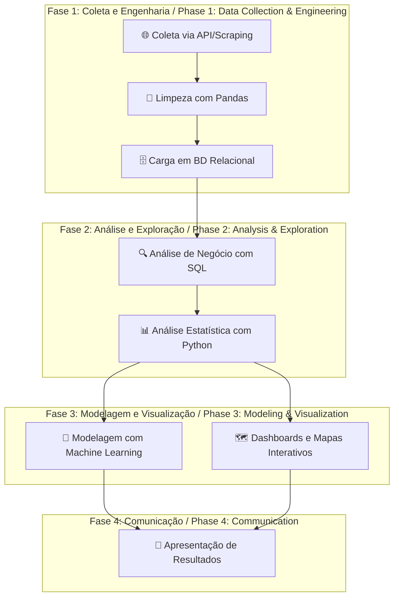

-----

# Applied Data Science Capstone: A Data Scientist's Thesis
<div align="center">
  
  
  
</div>

**Autor / Author:** Jefferson Firmino Mendes  
**Contato / Contact:** [GitHub](https://github.com/jeffthedeveloper) | [LinkedIn](www.linkedin.com/in/jfconsultoria)  
**Certificação / Certification:** IBM Data Science Professional Certificate (Coursera)

## 📄 Resumo (PT-BR) / Abstract (EN-US)

**PT-BR:** Este repositório é a tese final do Certificado Profissional IBM Data Science, demonstrando um fluxo de trabalho completo de ponta a ponta. O projeto resolve problemas práticos em domínios como mercado imobiliário, finanças e logística espacial, utilizando Python, SQL e Machine Learning. O principal resultado é um portfólio de análises, modelos preditivos e dashboards interativos que validam competências essenciais para um cientista de dados.

**EN-US:** This repository is the final thesis for the IBM Data Science Professional Certificate, demonstrating a complete end-to-end workflow. The project solves practical problems in domains such as real estate, finance, and space logistics using Python, SQL, and Machine Learning. The main outcome is a portfolio of analyses, predictive models, and interactive dashboards that validate a data scientist's core competencies.

## 1\. 🎓 A Tese: Uma Jornada de Maestria / The Thesis: A Journey of Mastery

**PT-BR:** Este repositório é a materialização da minha jornada através do universo da Ciência de Dados. Ele não é uma simples coleção de projetos, mas sim a **tese final** que consolida e conecta uma vasta gama de habilidades. Como um Trabalho de Conclusão de Curso (TCC), ele representa o ápice do aprendizado, onde teoria e prática se encontram para resolver problemas do mundo real.

A narrativa aqui contida guia o visitante pelo **fluxo de trabalho completo de um cientista de dados**, desde a coleta de dados brutos até a entrega de insights acionáveis através de modelos de machine learning e visualizações interativas.

**EN-US:** This repository embodies my journey through the Data Science universe. It's not a mere collection of projects, but rather the **final thesis** that consolidates and connects a wide range of skills. Like a final graduation project, it represents the pinnacle of learning, where theory and practice meet to solve real-world problems.

## 2\. 🕵️ Prova de Autoria e Ambiente Profissional / Proof of Authorship & Professional Environment

**PT-BR:** Para validar a autenticidade do trabalho, este repositório contém múltiplas **"impressões digitais" forenses** que comprovam uma abordagem proativa e original.

  * **Execução em Ambiente Linux Local:** Tracebacks nos notebooks apontam para um diretório home de um sistema Ubuntu (`/home/jeff/...`), validando o desenvolvimento em um ambiente de trabalho real.
  * **Customização em Português (BR):** O uso de strings, comentários e saídas em português (`"✅ Módulos importados com sucesso!"`) é uma forte evidência de que a análise e o código foram desenvolvidos originalmente.
  * **Iniciativa na Curadoria de Dados:** O projeto demonstra proatividade na substituição de datasets desatualizados por fontes mais recentes do Kaggle, uma habilidade crucial para qualquer cientista de dados.

**EN-US:** To validate the authenticity of the work presented here, this repository contains multiple forensic **"digital fingerprints"** that prove a proactive and original approach.

  * **Execution in a Local Linux Environment:** Tracebacks in the notebooks point directly to a home directory in an Ubuntu system (`/home/jeff/...`), confirming development in a real-world local environment.
  * **Customization in Brazilian Portuguese (PT-BR):** The use of strings, comments, and outputs in Portuguese (`"✅ Módulos importados com sucesso!"`) is strong evidence that the analysis and code were originally developed, not just replicated.
  * **Initiative in Data Curation:** The project demonstrates proactivity in replacing outdated datasets with more recent sources from Kaggle, a crucial skill for any data scientist.

## 3\. 🗺️ O Fluxo de Trabalho / The Workflow

*The following diagram illustrates the interconnection of the skills demonstrated in this repository, forming a complete value cycle.*



## 4\. 🏆 Destaques do Projeto: Habilidades em Ação

| Competência | Descrição | Artefato Principal em Destaque |
| :--- | :--- | :--- |
| **Engenharia de Dados e SQL** | Análise de múltiplos datasets da cidade de Chicago, carregados em um banco de dados Db2, para responder a perguntas complexas usando queries SQL com `JOINS`, `CASE`, `GROUP BY` e subqueries. | [Análise de Dados de Chicago com SQL](https://www.google.com/search?q=https://github.com/jeffthedeveloper/Applied-Data-Science-Capstone-End-to-End-Analysis-with-Python-SQL-and-Machine-Learning/blob/main/Applied-Capstone/Peer-Assignment/DB0201EN-PeerAssign-v5.ipynb) |
| **Análise Geoespacial Interativa** | Criação de um mapa interativo com Folium para analisar a localização dos locais de lançamento da SpaceX e sua relação com a infraestrutura circundante. | [Visualização Interativa com Folium](https://www.google.com/search?q=https://github.com/jeffthedeveloper/Applied-Data-Science-Capstone-End-to-End-Analysis-with-Python-SQL-and-Machine-Learning/blob/main/Applied-Capstone/06_SpaceX_Interactive_Visual_Analytics_Folium.ipynb) |
| **Machine Learning Preditivo** | Desenvolvimento ponta a ponta de modelos de Regressão para prever preços de imóveis. O processo é detalhado no notebook e validado por uma série de screenshots que provam a construção passo a passo. | [PROJETO FINAL PYTHON (Evidências)](https://github.com/jeffthedeveloper/Applied-Data-Science-Capstone-End-to-End-Analysis-with-Python-SQL-and-Machine-Learning/tree/main/Applied-Capstone/PROJETO%20FINAL%20PYTHON) |
| **Dashboarding e Web Scraping** | Extração de dados de ações (Tesla & GameStop) via `yfinance` e `BeautifulSoup` para a construção de um dashboard interativo para análise de mercado. | [Dashboard de Análise de Ações](https://www.google.com/search?q=https://github.com/jeffthedeveloper/Applied-Data-Science-Capstone-End-to-End-Analysis-with-Python-SQL-and-Machine-Learning/blob/main/Applied-Capstone/final-assignment.ipynb) |

## 5\. 📊 Resultados e Destaques Visuais / Results and Visual Highlights

**PT-BR:** Demonstrações visuais dos principais projetos, destacando a análise preditiva de preços de imóveis e a extração de dados do mercado de ações.

**EN-US:** Visual demonstrations of the main projects, highlighting the predictive analysis of house prices and the extraction of stock market data.

### Análise Preditiva de Preços de Imóveis / Predictive House Pricing Analysis

*Este GIF demonstra o processo de análise exploratória e a performance do modelo de regressão para prever os preços dos imóveis.*
*This GIF demonstrates the exploratory data analysis process and the performance of the regression model for predicting house prices.*

<div align="center">
  
</div>

### Extração e Visualização de Dados de Ações / Stock Data Extraction and Visualization

*Este GIF exibe o funcionamento do script que extrai dados financeiros das ações da Tesla e GameStop, culminando na criação de um dashboard interativo.*
*This GIF showcases the script that extracts financial data for Tesla and GameStop stocks, culminating in the creation of an interactive dashboard.*

<div align="center">
  
</div>

## 6\. 🛠️ Ferramentas e Tecnologias / Tools & Technologies

  * **Linguagens / Languages:** Python, SQL
  * **Bibliotecas de Dados / Data Libraries:** Pandas, NumPy
  * **Visualização / Visualization:** Matplotlib, Seaborn, Plotly Dash, Folium
  * **Machine Learning:** Scikit-learn (Linear Regression, Ridge Regression, Pipelines)
  * **Banco de Dados / Database:** IBM Db2, SQLite
  * **Desenvolvimento / Development:** Jupyter Lab/Notebooks, Git/GitHub, Ambiente Linux (Ubuntu) / Linux Environment (Ubuntu)

## 7\. 🚀 Reprodutibilidade e Instalação / Reproducibility & Setup

**PT-BR:** Para clonar e executar este projeto localmente, siga os passos abaixo.

**EN-US:** To clone and run this project locally, follow the steps below.

1.  **Clone o repositório / Clone the repository:**

    ```bash
    git clone https://github.com/jeffthedeveloper/applied-data-science-capstone-end-to-end-analysis-with-python-sql-and-machine-learning.git
    cd applied-data-science-capstone-end-to-end-analysis-with-python-sql-and-machine-learning
    ```

2.  **Crie e ative um ambiente virtual / Create and activate a virtual environment:**

    ```bash
    python -m venv venv
    source venv/bin/activate  # No Windows: venv\Scripts\activate
    ```

3.  **Instale as dependências / Install dependencies:**

    ```bash
    pip install -r requirements.txt
    ```

4.  **Inicie o Jupyter Lab / Start Jupyter Lab:**

    ```bash
    jupyter lab
    ```

## 8\. 🎯 Limitações e Trabalhos Futuros / Limitations & Future Work

**PT-BR:** 

  * **Limitações:** Alguns projetos, como a análise de imóveis, utilizaram datasets do Kaggle como alternativa a fontes originais que estavam inacessíveis. Os modelos preditivos podem ser otimizados com mais engenharia de features e ajuste de hiperparâmetros.
  * **Trabalhos Futuros:** Os próximos passos incluem o deploy de um dos modelos como uma API REST, a criação de um pipeline de dados automatizado com Airflow e a configuração de GitHub Actions para testes contínuos.

**EN-US:**

  * **Limitations:** Some projects, such as real estate analysis, used Kaggle datasets as an alternative to inaccessible original sources. The predictive models can be optimized with more feature engineering and hyperparameter tuning.
  * **Future Work:** Next steps include deploying one of the models as a REST API, creating an automated data pipeline with Airflow, and setting up GitHub Actions for continuous testing.

## 9\. 🤝 Contribuição / Contributing

**PT-BR:** Este repositório é, primariamente, um portfólio pessoal. No entanto, sugestões de melhoria, correções de bugs ou otimizações são bem-vindas. Sinta-se à vontade para abrir uma *Issue* para discutir mudanças ou submeter um *Pull Request*.

**EN-US:** This repository is primarily a personal portfolio. However, suggestions for improvements, bug fixes, or optimizations are welcome. Feel free to open an *Issue* to discuss changes or submit a *Pull Request*.

## 10\. 🧾 Créditos e Fontes / Credits & Sources

  * **Curso Base / Base Course:** [IBM Data Science Professional Certificate](https://www.coursera.org/professional-certificates/ibm-data-science) via Coursera.
  * **Datasets:** Agradecimentos à comunidade Kaggle por fornecer datasets alternativos. / Thanks to the Kaggle community for providing alternative datasets.
  * **Principais Bibliotecas / Main Libraries:** Pandas, Scikit-learn, Matplotlib, Seaborn, Plotly, Folium.

## 11\. 📜 Licença / License

Este trabalho educacional está licenciado sob a **Licença MIT**.  
This educational work is licensed under the **MIT License**.
