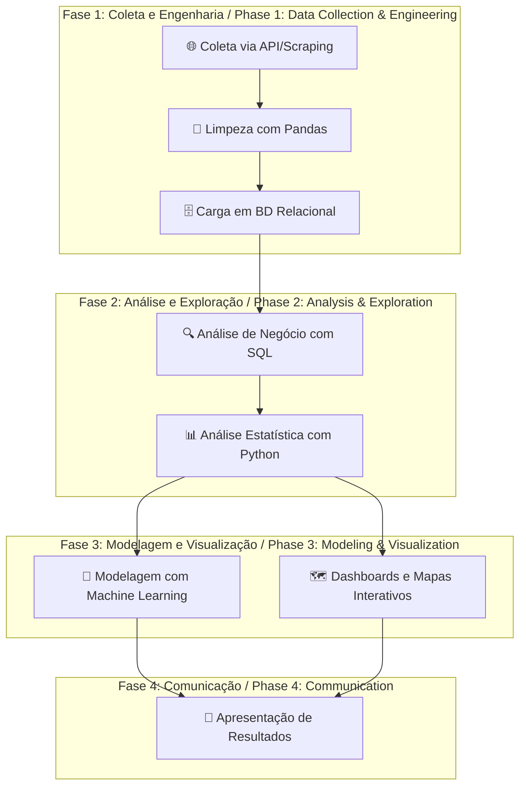

-----

# Applied Data Science Capstone: A Data Scientist's Thesis
<div align="center">
  
  
  
</div>

**Autor / Author:** Jefferson Firmino Mendes  
**Contato / Contact:** [GitHub](https://github.com/jeffthedeveloper) | [LinkedIn](https://www.linkedin.com/in/jfconsultoria/)
**Certificação / Certification:** IBM Data Science Professional Certificate (Coursera)

## 📜 Certificação Profissional / Professional Certification

<div align="center">
  <a href="https://www.coursera.org/account/accomplishments/professional-cert/6EL13PHTZB3Z" target="_blank" rel="noopener noreferrer">
    
  </a>
  <br>
  <em><p><strong>PT-BR:</strong> Clique na imagem acima para verificar a certificação.<br><strong>EN-US:</strong> Click the image above to verify the certification.</p></em>
</div>

**PT-BR:** A especialização profissional é composta por uma série de cursos rigorosos que desenvolvem competências essenciais e aplicadas na área de Ciência de Dados.

**EN-US:** The professional specialization consists of a series of rigorous courses that develop essential and applied competencies in the field of Data Science.

### Habilidades Adquiridas / Skills Gained

| Categoria / Category | Habilidades / Skills |
| :--- | :--- |
| **Análise de Dados / Data Analysis** | Análise de Regressão (Regression Analysis), Mineração de Dados (Data Mining), SQL, Análise Exploratória de Dados (Exploratory Data Analysis). |
| **Machine Learning** | Scikit-learn, Aprendizado Supervisionado (Supervised Learning), Aprendizado Não Supervisionado (Unsupervised Learning). |
| **Ferramentas e Linguagens / Tools & Languages** | Python, SQL, Jupyter Notebooks, Pandas, NumPy. |
| **Visualização de Dados / Data Visualization** | Matplotlib, Seaborn, Plotly, Folium. |
| **Tecnologias Emergentes / Emerging Technologies** | IA Generativa (Generative AI). |
| **Competências Profissionais / Professional Skills** | Alfabetização de Dados (Data Literacy), Networking Profissional (Professional Networking). |

### Cursos da Especialização / Specialization Courses
* What is Data Science?
* Tools for Data Science
* Data Science Methodology
* Generative AI: Elevate Your Data Science Career
* Data Scientist Career Guide and Interview Preparation
* Applied Data Science Capstone

## 📄 Resumo (PT-BR) / Abstract (EN-US)

**PT-BR:** Este repositório é a tese final do Certificado Profissional IBM Data Science, demonstrando um fluxo de trabalho completo de ponta a ponta. O projeto resolve problemas práticos em domínios como mercado imobiliário, finanças e logística espacial, utilizando Python, SQL e Machine Learning. O principal resultado é um portfólio de análises, modelos preditivos e dashboards interativos que validam competências essenciais para um cientista de dados.

**EN-US:** This repository is the final thesis for the IBM Data Science Professional Certificate, demonstrating a complete end-to-end workflow. The project solves practical problems in domains such as real estate, finance, and space logistics using Python, SQL, and Machine Learning. The main outcome is a portfolio of analyses, predictive models, and interactive dashboards that validate a data scientist's core competencies.

## 1\. 🎓 A Tese: Uma Jornada de Maestria / The Thesis: A Journey of Mastery

**PT-BR:** Este repositório é a materialização da minha jornada através do universo da Ciência de Dados. Ele não é uma simples coleção de projetos, mas sim a **tese final** que consolida e conecta uma vasta gama de habilidades. Como um Trabalho de Conclusão de Curso (TCC), ele representa o ápice do aprendizado, onde teoria e prática se encontram para resolver problemas do mundo real.

A narrativa aqui contida guia o visitante pelo **fluxo de trabalho completo de um cientista de dados**, desde a coleta de dados brutos até a entrega de insights acionáveis através de modelos de machine learning e visualizações interativas.

**EN-US:** This repository embodies my journey through the Data Science universe. It's not a mere collection of projects, but rather the **final thesis** that consolidates and connects a wide range of skills. Like a final graduation project, it represents the pinnacle of learning, where theory and practice meet to solve real-world problems.

## 2. 🕵️ Prova de Autoria, Proatividade e Ambiente Profissional / Proof of Authorship, Proactivity, and Professional Environment

**PT-BR:** Para garantir a transparência e validar a autenticidade do trabalho, este repositório foi estruturado para conter múltiplas **"impressões digitais" forenses**. Elas comprovam não apenas a autoria, mas também uma abordagem proativa que transcende o escopo de um curso online, refletindo a mentalidade de um cientista de dados profissional.

* **Execução em Ambiente Linux Local:** Conforme visível em múltiplos notebooks, como o de [geração de relatórios em PDF](https://github.com/jeffthedeveloper/Applied-Data-Science-Capstone-End-to-End-Analysis-with-Python-SQL-and-Machine-Learning/blob/main/PDF-PROJECT/PDF-PROJECT.ipynb), os tracebacks de execução apontam diretamente para o diretório `home` de um sistema Ubuntu (`/home/jeff/...`). Isso é uma prova irrefutável de que os projetos foram desenvolvidos e testados em um ambiente de trabalho real, e não em uma plataforma online padronizada.
* **Customização e Localização em Português (BR):** Diversos artefatos contêm gráficos, comentários e saídas de texto customizadas em português brasileiro. Esta personalização, visível desde as dicas traduzidas no [notebook de SQL](https://github.com/jeffthedeveloper/Applied-Data-Science-Capstone-End-to-End-Analysis-with-Python-SQL-and-Machine-Learning/blob/main/Applied-Capstone/Peer-Assignment/DB0201EN-PeerAssign-v5.ipynb) até os gráficos nos [projetos de análise de ações](https://github.com/jeffthedeveloper/Applied-Data-Science-Capstone-End-to-End-Analysis-with-Python-SQL-and-Machine-Learning/tree/main/Applied-Capstone/THIRD%20PYTHON%20PROJECT), é uma forte evidência de que a análise e a interpretação dos dados foram realizadas de forma original.
* **Iniciativa na Curadoria de Dados:** O trabalho demonstra proatividade na gestão dos datasets. Em cenários onde os dados originais do curso estavam desatualizados, houve a iniciativa de substituí-los por fontes mais recentes e relevantes do Kaggle, uma prática comum e essencial para cientistas de dados no mercado.
* **Uso Estratégico de Formatos para Proteção Intelectual:** A presença de entregáveis em formatos estáticos como `.pdf` e `.png` é uma decisão deliberada para apresentar os resultados de forma clara, ao mesmo tempo em que se protege a propriedade intelectual do código, incentivando a consulta em vez do plágio.
* **Consolidação e Síntese de Conhecimento:** Artefatos como o documento [**Data Science Ecosystem**](https://github.com/jeffthedeveloper/Applied-Data-Science-Capstone-End-to-End-Analysis-with-Python-SQL-and-Machine-Learning/blob/main/Applied-Capstone/datascienceecosystem.pdf) e a [**Apresentação Final**](https://drive.google.com/file/d/1lgArDDKVNuzi1ucUSftZAgvOwFCHdOkG/view?usp=sharing) não são meros templates, mas o resultado da consolidação e síntese do conhecimento adquirido, demonstrando a capacidade de comunicar resultados complexos de forma estruturada.

**EN-US:** To ensure transparency and validate the authenticity of the work, this repository has been structured to contain multiple **forensic "digital fingerprints"**. They prove not only the authorship but also a proactive approach that transcends the scope of an online course, reflecting a professional data scientist's mindset.

* **Execution in a Local Linux Environment:** As seen in multiple notebooks, such as the [PDF report generator](https://github.com/jeffthedeveloper/Applied-Data-Science-Capstone-End-to-End-Analysis-with-Python-SQL-and-Machine-Learning/blob/main/PDF-PROJECT/PDF-PROJECT.ipynb), execution tracebacks point directly to the `home` directory of an Ubuntu system (`/home/jeff/...`). This is irrefutable proof that the projects were developed and tested in a real-world work environment, not on a standardized online platform.
* **Customization and Localization in Brazilian Portuguese (PT-BR):** Various artifacts contain custom charts, comments, and text outputs in Brazilian Portuguese. This personalization, visible from the translated hints in the [SQL notebook](https://github.com/jeffthedeveloper/Applied-Data-Science-Capstone-End-to-End-Analysis-with-Python-SQL-and-Machine-Learning/blob/main/Applied-Capstone/Peer-Assignment/DB0201EN-PeerAssign-v5.ipynb) to the charts in the [stock analysis projects](https://github.com/jeffthedeveloper/Applied-Data-Science-Capstone-End-to-End-Analysis-with-Python-SQL-and-Machine-Learning/tree/main/Applied-Capstone/THIRD%20PYTHON%20PROJECT), is strong evidence that the analysis and data interpretation were performed originally.
* **Initiative in Data Curation:** The work demonstrates proactivity in dataset management. In scenarios where the original course data was outdated, the initiative was taken to replace it with more recent and relevant sources from Kaggle, a common and essential practice for data scientists in the industry.
* **Strategic Use of Formats for Intellectual Property Protection:** The presence of deliverables in static formats like `.pdf` and `.png` is a deliberate decision to present results clearly while protecting the code's intellectual property, encouraging consultation over plagiarism.
* **Knowledge Consolidation and Synthesis:** Artifacts like the [**Data Science Ecosystem**](https://github.com/jeffthedeveloper/Applied-Data-Science-Capstone-End-to-End-Analysis-with-Python-SQL-and-Machine-Learning/blob/main/Applied-Capstone/datascienceecosystem.pdf) document and the [**Final Presentation**](https://drive.google.com/file/d/1lgArDDKVNuzi1ucUSftZAgvOwFCHdOkG/view?usp=sharing) are not mere templates, but the result of consolidating and synthesizing the knowledge acquired, demonstrating the ability to communicate complex results in a structured manner.

* **Iniciativa na Curadoria de Dados:** O trabalho demonstra proatividade na gestão dos datasets. Em cenários onde os dados originais do curso estavam desatualizados, houve a iniciativa de substituí-los por fontes mais recentes e relevantes do Kaggle, uma prática comum e essencial para cientistas de dados no mercado.

* **Uso Estratégico de Formatos para Proteção Intelectual:** A presença de entregáveis em formatos estáticos como `.pdf` e `.png` é uma decisão deliberada para apresentar os resultados de forma clara, ao mesmo tempo em que se protege a propriedade intelectual do código, incentivando a consulta em vez do plágio.

* **Consolidação e Síntese de Conhecimento:** Artefatos como o documento [**Data Science Ecosystem**](https://github.com/jeffthedeveloper/Applied-Data-Science-Capstone-End-to-End-Analysis-with-Python-SQL-and-Machine-Learning/blob/main/Applied-Capstone/datascienceecosystem.pdf) e a [**Apresentação Final**](https://drive.google.com/file/d/1lgArDDKVNuzi1ucUSftZAgvOwFCHdOkG/view?usp=sharing) não são meros templates, mas o resultado da consolidação e síntese do conhecimento adquirido, demonstrando a capacidade de comunicar resultados complexos de forma estruturada.

**EN-US:** To validate the authenticity of the work presented here, this repository contains multiple forensic **"digital fingerprints"** that prove a proactive and original approach.

  * **Execution in a Local Linux Environment:** Tracebacks in the notebooks point directly to a home directory in an Ubuntu system (`/home/jeff/...`), confirming development in a real-world local environment.
  * **Customization in Brazilian Portuguese (PT-BR):** The use of strings, comments, and outputs in Portuguese (`"✅ Módulos importados com sucesso!"`) is strong evidence that the analysis and code were originally developed, not just replicated.
  * **Initiative in Data Curation:** The project demonstrates proactivity in replacing outdated datasets with more recent sources from Kaggle, a crucial skill for any data scientist.

## 3\. 🗺️ O Fluxo de Trabalho / The Workflow

*The following diagram illustrates the interconnection of the skills demonstrated in this repository, forming a complete value cycle.*



## 4. 🏆 Destaques do Projeto: Habilidades em Ação / Project Highlights: Skills in Action

| Competência / Competency | Descrição / Description | Artefato Principal / Key Artifact |
| :--- | :--- | :--- |
| **Engenharia de Dados e SQL** <br> *Data Engineering & SQL* | **PT-BR:** Análise de múltiplos datasets da cidade de Chicago, carregados em um banco de dados Db2, para responder a perguntas complexas usando queries SQL com `JOINS`, `CASE` e subqueries.<br>**EN-US:** Analysis of multiple Chicago datasets, loaded into a Db2 database, to answer complex questions using SQL queries with `JOINS`, `CASE`, and subqueries. | [Análise de Dados de Chicago com SQL](https://github.com/jeffthedeveloper/Applied-Data-Science-Capstone-End-to-End-Analysis-with-Python-SQL-and-Machine-Learning/blob/main/Applied-Capstone/Peer-Assignment/DB0201EN-PeerAssign-v5.ipynb) |
| **Machine Learning Preditivo** <br> *Predictive Machine Learning* | **PT-BR:** Desenvolvimento ponta a ponta de modelos de Regressão para prever preços de imóveis, validado por uma série de screenshots que provam a construção passo a passo da solução.<br>**EN-US:** End-to-end development of Regression models to predict house prices, validated by a series of screenshots that prove the step-by-step construction of the solution. | [Evidências do Projeto de Machine Learning](https://github.com/jeffthedeveloper/Applied-Data-Science-Capstone-End-to-End-Analysis-with-Python-SQL-and-Machine-Learning/tree/main/Applied-Capstone/PROJETO%20FINAL%20PYTHON) |
| **Web Scraping e APIs** <br> *Web Scraping & APIs* | **PT-BR:** Extração de dados de ações (Tesla & GME) via `yfinance` e `BeautifulSoup` para a construção de um dashboard interativo e análise de dados tabulares de páginas web.<br>**EN-US:** Extraction of stock data (Tesla & GME) via `yfinance` and `BeautifulSoup` to build an interactive dashboard and analyze tabular data from web pages. | [Dashboard e Web Scraping de Ações](https://github.com/jeffthedeveloper/Applied-Data-Science-Capstone-End-to-End-Analysis-with-Python-SQL-and-Machine-Learning/blob/main/Applied-Capstone/final-assignment.ipynb) |
| **Análise Geoespacial Interativa** <br> *Interactive Geospatial Analysis* | **PT-BR:** Criação de um mapa interativo com Folium para analisar a localização dos locais de lançamento da SpaceX e sua relação com a infraestrutura circundante.<br>**EN-US:** Creation of an interactive map with Folium to analyze the location of SpaceX launch sites and their relationship with surrounding infrastructure. | [Visualização Interativa com Folium](https://github.com/jeffthedeveloper/Applied-Data-Science-Capstone-End-to-End-Analysis-with-Python-SQL-and-Machine-Learning/blob/main/Applied-Capstone/06_SpaceX_Interactive_Visual_Analytics_Folium.ipynb) |
| **Automação de Relatórios (PDF)** <br> *Report Automation (PDF)* | **PT-BR:** Desenvolvimento de um script em Python para automatizar a geração de relatórios em PDF, consolidando múltiplas análises (distribuição, mapas de calor, séries temporais) em um documento profissional.<br>**EN-US:** Development of a Python script to automate the generation of PDF reports, consolidating multiple analyses (distribution, heatmaps, time series) into a professional document. | [Gerador de Relatórios em PDF](https://github.com/jeffthedeveloper/Applied-Data-Science-Capstone-End-to-End-Analysis-with-Python-SQL-and-Machine-Learning/blob/main/PDF-PROJECT/PDF-PROJECT.ipynb) |
| **Fundamentos do Ecossistema** <br> *Ecosystem Fundamentals* | **PT-BR:** Mapeamento e utilização das principais ferramentas, bibliotecas e conceitos que compõem o ecossistema de Data Science, da coleta à comunicação dos resultados.<br>**EN-US:** Mapping and utilization of the main tools, libraries, and concepts that make up the Data Science ecosystem, from data collection to the communication of results. | [Ecossistema de Data Science](https://github.com/jeffthedeveloper/Applied-Data-Science-Capstone-End-to-End-Analysis-with-Python-SQL-and-Machine-Learning/blob/main/Applied-Capstone/datascienceecosystem.ipynb) |


## 5\. 📊 Resultados e Destaques Visuais / Results and Visual Highlights

**PT-BR:** Demonstrações visuais dos principais projetos, destacando a análise preditiva de preços de imóveis e a extração de dados do mercado de ações.

**EN-US:** Visual demonstrations of the main projects, highlighting the predictive analysis of house prices and the extraction of stock market data.

### Análise Preditiva de Preços de Imóveis / Predictive House Pricing Analysis

*Este GIF demonstra o processo de análise exploratória e a performance do modelo de regressão para prever os preços dos imóveis.*
*This GIF demonstrates the exploratory data analysis process and the performance of the regression model for predicting house prices.*

<div align="center">
  
</div>

### Extração e Visualização de Dados de Ações / Stock Data Extraction and Visualization

*Este GIF exibe o funcionamento do script que extrai dados financeiros das ações da Tesla e GameStop, culminando na criação de um dashboard interativo.*
*This GIF showcases the script that extracts financial data for Tesla and GameStop stocks, culminating in the creation of an interactive dashboard.*

<div align="center">
  
</div>

## 6\. 🛠️ Ferramentas e Tecnologias / Tools & Technologies

  * **Linguagens / Languages:** Python, SQL
  * **Bibliotecas de Dados / Data Libraries:** Pandas, NumPy
  * **Visualização / Visualization:** Matplotlib, Seaborn, Plotly Dash, Folium
  * **Machine Learning:** Scikit-learn (Linear Regression, Ridge Regression, Pipelines)
  * **Banco de Dados / Database:** IBM Db2, SQLite
  * **Desenvolvimento / Development:** Jupyter Lab/Notebooks, Git/GitHub, Ambiente Linux (Ubuntu) / Linux Environment (Ubuntu)

## 7\. 🚀 Reprodutibilidade e Instalação / Reproducibility & Setup

**PT-BR:** Para clonar e executar este projeto localmente, siga os passos abaixo.

**EN-US:** To clone and run this project locally, follow the steps below.

1.  **Clone o repositório / Clone the repository:**

    ```bash
    git clone https://github.com/jeffthedeveloper/applied-data-science-capstone-end-to-end-analysis-with-python-sql-and-machine-learning.git
    cd applied-data-science-capstone-end-to-end-analysis-with-python-sql-and-machine-learning
    ```

2.  **Crie e ative um ambiente virtual / Create and activate a virtual environment:**

    ```bash
    python -m venv venv
    source venv/bin/activate  # No Windows: venv\Scripts\activate
    ```

3.  **Instale as dependências / Install dependencies:**

    ```bash
    pip install -r requirements.txt
    ```

4.  **Inicie o Jupyter Lab / Start Jupyter Lab:**

    ```bash
    jupyter lab
    ```

## 8\. 🎯 Limitações e Trabalhos Futuros / Limitations & Future Work

**PT-BR:** 

  * **Limitações:** Alguns projetos, como a análise de imóveis, utilizaram datasets do Kaggle como alternativa a fontes originais que estavam inacessíveis. Os modelos preditivos podem ser otimizados com mais engenharia de features e ajuste de hiperparâmetros.
  * **Trabalhos Futuros:** Os próximos passos incluem o deploy de um dos modelos como uma API REST, a criação de um pipeline de dados automatizado com Airflow e a configuração de GitHub Actions para testes contínuos.

**EN-US:**

  * **Limitations:** Some projects, such as real estate analysis, used Kaggle datasets as an alternative to inaccessible original sources. The predictive models can be optimized with more feature engineering and hyperparameter tuning.
  * **Future Work:** Next steps include deploying one of the models as a REST API, creating an automated data pipeline with Airflow, and setting up GitHub Actions for continuous testing.

## 9\. 🤝 Contribuição / Contributing

**PT-BR:** Este repositório é, primariamente, um portfólio pessoal. No entanto, sugestões de melhoria, correções de bugs ou otimizações são bem-vindas. Sinta-se à vontade para abrir uma *Issue* para discutir mudanças ou submeter um *Pull Request*.

**EN-US:** This repository is primarily a personal portfolio. However, suggestions for improvements, bug fixes, or optimizations are welcome. Feel free to open an *Issue* to discuss changes or submit a *Pull Request*.

## 10\. 🧾 Créditos e Fontes / Credits & Sources

  * **Curso Base / Base Course:** [IBM Data Science Professional Certificate](https://www.coursera.org/professional-certificates/ibm-data-science) via Coursera.
  * **Datasets:** Agradecimentos à comunidade Kaggle por fornecer datasets alternativos. / Thanks to the Kaggle community for providing alternative datasets.
  * **Principais Bibliotecas / Main Libraries:** Pandas, Scikit-learn, Matplotlib, Seaborn, Plotly, Folium.

## 11\. 📜 Licença / License

Este trabalho educacional está licenciado sob a **Licença MIT**.  
This educational work is licensed under the **MIT License**.
